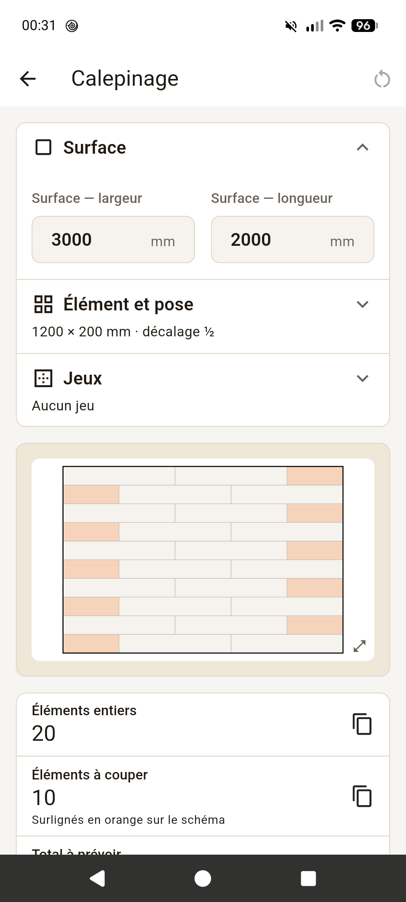
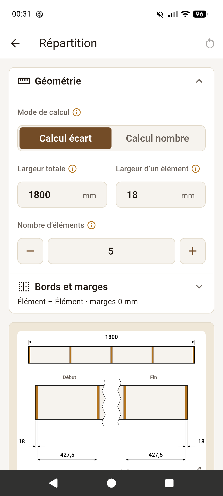
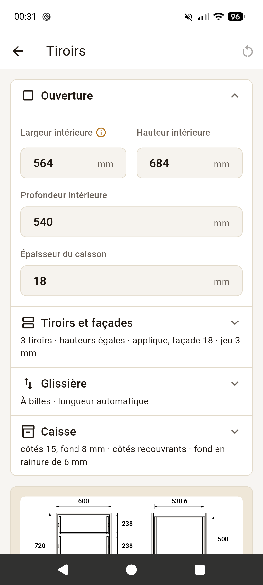
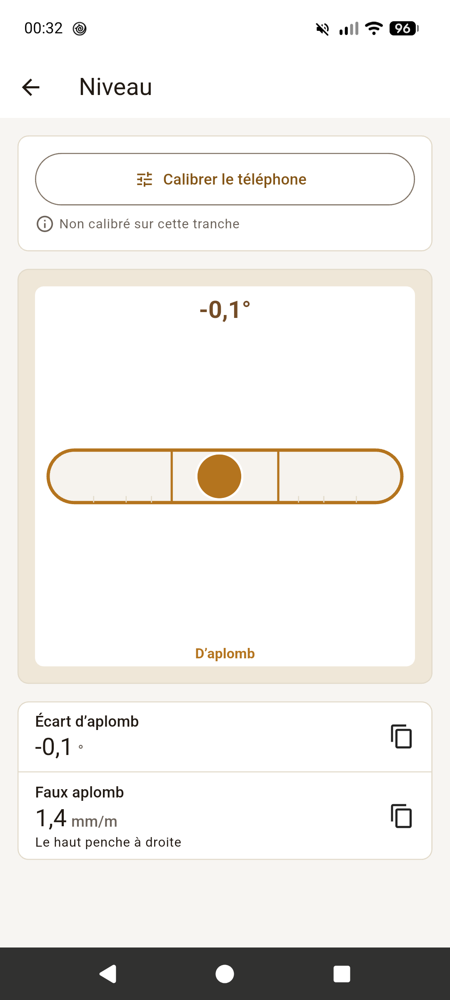
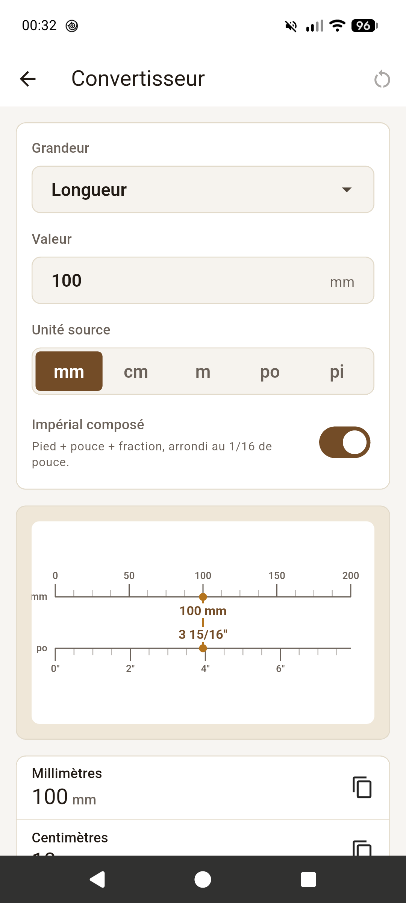

# Fabrique

[](https://github.com/radiium/fabrique/actions/workflows/ci.yml)
[](https://github.com/radiium/fabrique/releases/latest)
[](LICENSE)

[English](README.md) · **Français**

Cinq outils de calcul pour l'atelier de menuiserie, sur Android et sur le web. Chaque résultat se met à jour pendant la saisie, avec un schéma coté qui s'exporte en image.

Pas de publicité, pas de compte, aucun accès à Internet : vos saisies restent sur votre appareil.

**[Essayer dans le navigateur](https://radiium.github.io/fabrique/)** · **[Télécharger l'APK](https://github.com/radiium/fabrique/releases/latest)**

<p>
  
  
  
  
  
</p>

## Les outils

- **Calepinage** : poser des éléments identiques sur une surface (carrelage, lames, parquet, dalles, plaques). Éléments entiers et à couper, dimensions des coupes, pourcentage de perte, pose droite ou décalée, jeux et jeu périphérique.
- **Répartition** : répartir des éléments sur une largeur (barreaudage, lames, étagères, axes de perçage). À partir d'un nombre ou d'un écart voulu, avec marges, et l'entraxe à reporter.
- **Tiroirs** : à partir de l'ouverture du caisson, la fiche de débit des caisses et des façades, la longueur des glissières et la position de leurs vis.
- **Niveau** : niveau et aplomb, le téléphone posé sur la tranche, calibré par retournement.
- **Convertisseur** : longueurs, surfaces, volumes, masses et pressions, limités aux unités qu'on croise à l'atelier. Pouces en fractions au 1/16, pied-planche.

Tout est en millimètres. En français et en anglais.

## Installer

- **Android** : l'APK de la [dernière version](https://github.com/radiium/fabrique/releases/latest). IzzyOnDroid et F-Droid sont en cours.
- **Web** : [radiium.github.io/fabrique](https://radiium.github.io/fabrique/). Il s'installe comme une app (« Sur l'écran d'accueil », « Installer l'app ») et marche hors ligne après une première visite, sur iPhone et sur ordinateur aussi.

## Un retour

Un bug, un résultat faux, un outil qui manque : [ouvrir une issue](https://github.com/radiium/fabrique/issues).

## Développement

Flutter 3.47, Dart 3.13.

```bash
flutter run                   # -d chrome pour le web
flutter test
flutter analyze
dart run build_runner build   # après un changement @freezed / @riverpod
flutter gen-l10n              # après un changement de lib/l10n/app_*.arb
```

La documentation est dans [`docs/`](docs/README.md), la publication dans [`docs/release.md`](docs/release.md).

## Licence

Logiciel libre sous licence [GNU GPL v3 ou ultérieure](LICENSE) (`GPL-3.0-or-later`), fourni sans aucune garantie.
