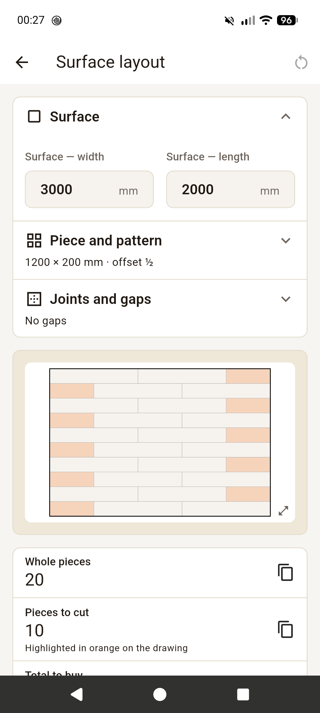
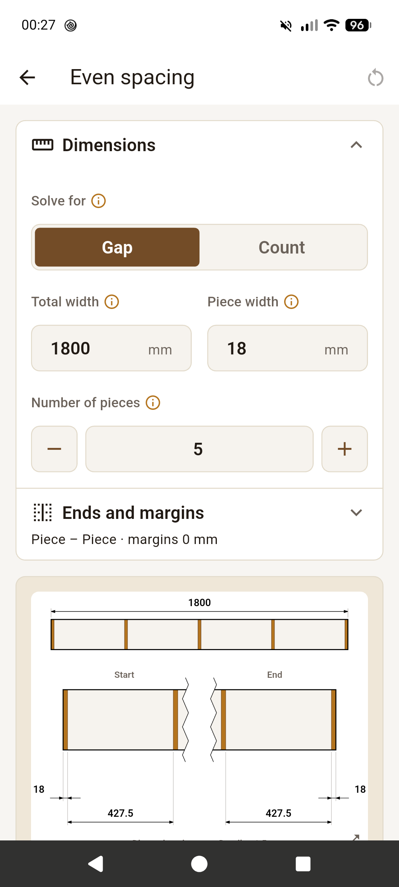
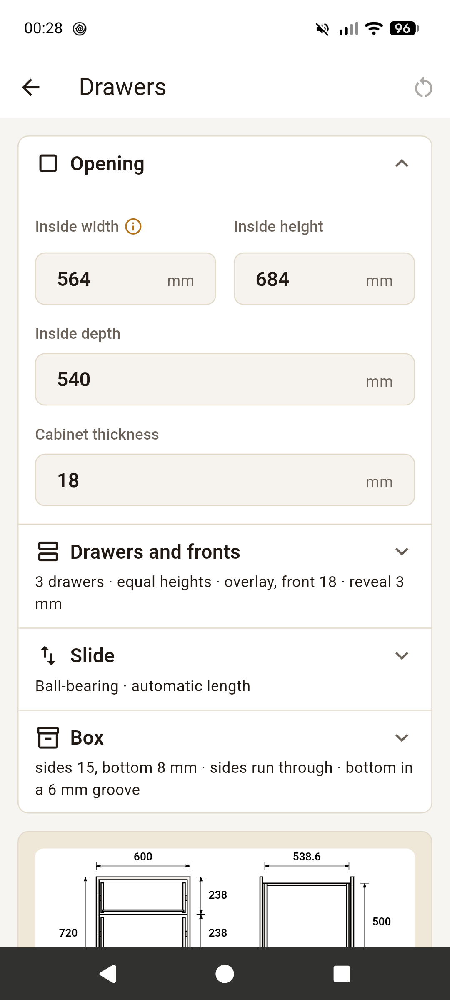
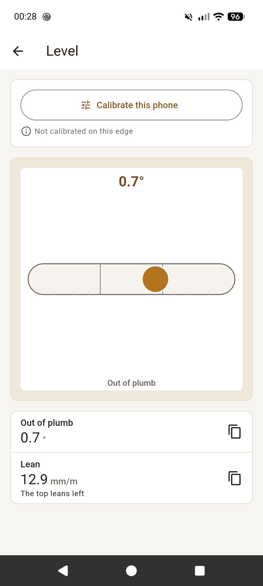
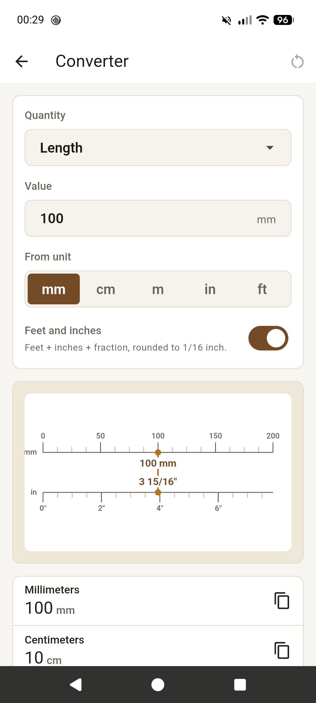

# Fabrique

**English** · [Français](README.fr.md)

Five calculators for the woodworking shop, on Android and the web. Every result updates as you type, with a dimensioned drawing you can export as an image.

No ads, no account, no Internet access: your inputs stay on your device.

**[Try it in your browser](https://radiium.github.io/fabrique/)** · **[Download the APK](https://github.com/radiium/fabrique/releases/latest)**

<p>
  
  
  
  
  
</p>

## The tools

- **Surface layout**: lay identical pieces over a surface (tile, boards, flooring, pavers, sheets). Whole and cut pieces, cut sizes, waste percentage, stacked or offset joints, gaps and perimeter gap.
- **Even spacing**: space pieces across a width (balusters, slats, shelves, drilling centers). From a count or a target gap, with margins, and the pitch to mark out.
- **Drawers**: from the cabinet opening, the cut list for the boxes and fronts, the slide length and where to screw the slides.
- **Level**: spirit level and plumb with the phone standing on its edge, calibrated by reversal.
- **Converter**: lengths, areas, volumes, weights and pressures, limited to the units you meet in the shop. Inches in fractions down to 1/16, board feet.

Everything is in millimeters. In French and English.

## Install

- **Android**: the APK from the [latest release](https://github.com/radiium/fabrique/releases/latest). IzzyOnDroid and F-Droid are on the way.
- **Web**: [radiium.github.io/fabrique](https://radiium.github.io/fabrique/). It installs like an app (“Add to Home screen”, “Install app”) and works offline after the first visit, on iPhone and desktop too.

## Feedback

A bug, a wrong result, a missing tool: [open an issue](https://github.com/radiium/fabrique/issues).

## Development

Flutter 3.47, Dart 3.13.

```bash
flutter run                   # -d chrome for the web
flutter test
flutter analyze
dart run build_runner build   # after changing @freezed / @riverpod
flutter gen-l10n              # after changing lib/l10n/app_*.arb
```

The documentation is in [`docs/`](docs/README.md) (in French), publishing in [`docs/release.md`](docs/release.md).

## License

Free software under the [GNU GPL v3 or later](LICENSE) (`GPL-3.0-or-later`), provided without any warranty.
